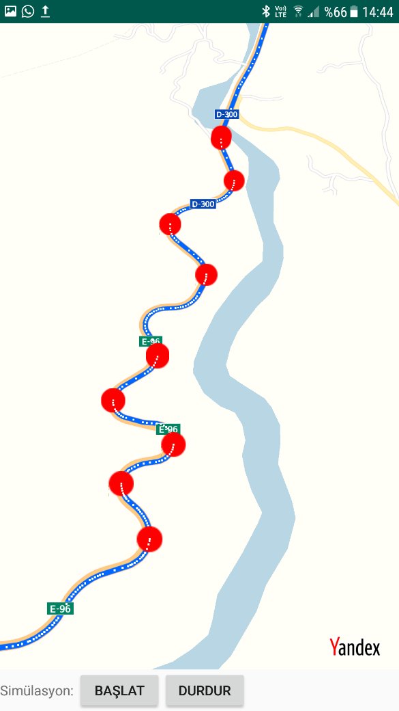
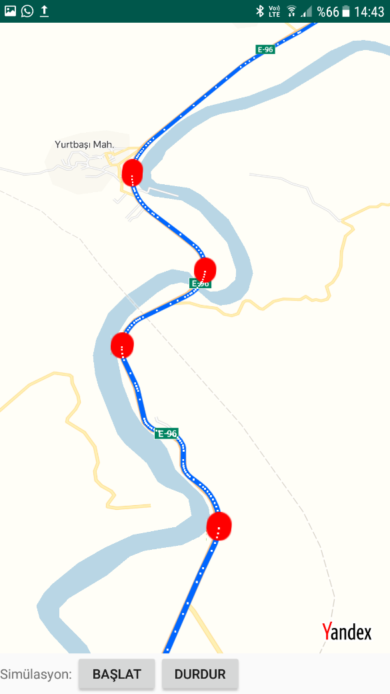
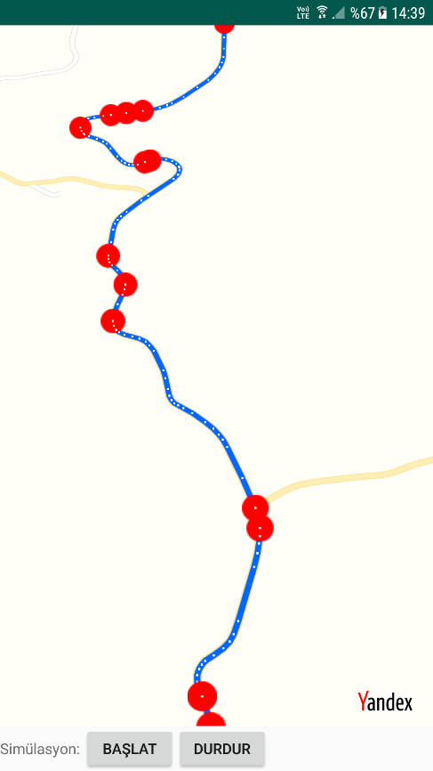
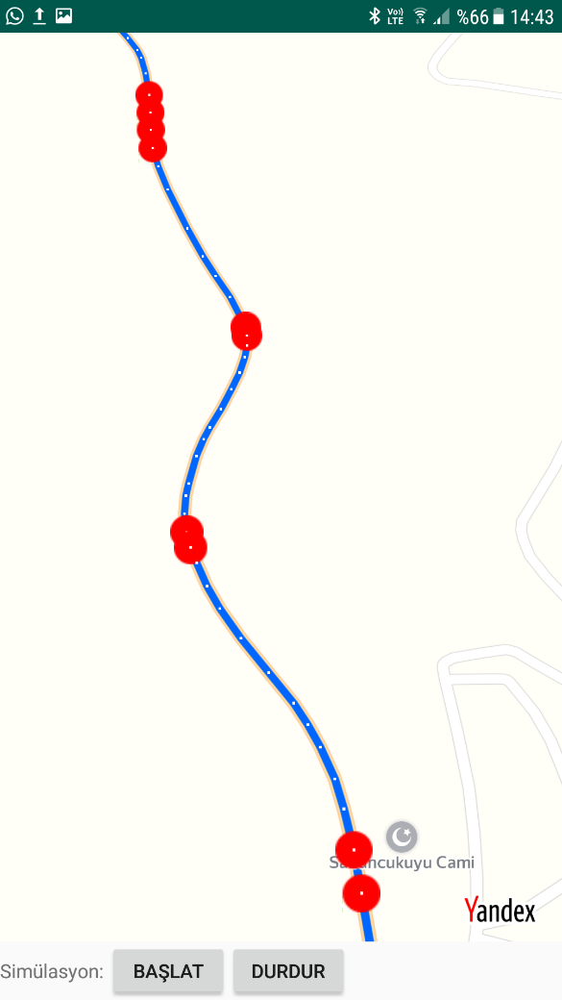

# SharpBendDetection / Keskin Viraj Tespit
Ülkemizde artan nüfus ve artan taşıt sayısıyla beraber yıl içerisinde trafik kazaları artmaktadır. Bununla beraber ölüm, yaralanma ve sakat kalma gibi üzücü olaylar yaşanmaktadır. Trafik kazalarının gerçekleşmesinde sürücü, yolcu, yaya, yol ve taşıt faktörleri etkin olmaktadır. Her ne kadar son yıllarda yeni yapılan ve genişletilip yenilenen yollarla birlikte yol faktörünün etkisi azalmakta olsa da halen trafik kazalarında yol durumu ve şekli kazada bir etmendir. Yol faktörü içerisinde de arazinin engebeli olmasından ötürü bazı bölgelerde yollarda keskin virajlar bulunabilmektedir. Keskin virajlar da trafik kazalarının gerçekleşmesinden etkin bir faktördür.

Günümüzde kullanılan navigasyon yazılımlarında rota üzerinde keskin virajlar gösterilmemektedir. Bu sebeple yolu bilmeyen sürücüler yoldaki keskin virajlarda trafik kazası geçirebilmekte ya da virajlarda sürüş zorluğu yaşamaktadırlar.

Bu sebeplerden ötürü yollardaki keskin virajları tespit edebilen Android işletim sisteminde çalışabilen bir mobil uygulama geliştirilmiştir. Keskin virajın tespiti noktasında koordinat sisteminde eğim hesaplamaları algoritma oluşturulmasında önemli yer tutmaktadır. Algoritma sonrasında harita görüntüleme işlemleri için uygun Uygulama Geliştirme Kiti (SDK: Software Development Kit) seçilmiştir. Uygulama rota üzerindeki keskin virajları tespit edip bu noktalara kırmızı yuvarlak yer işaretleri ekleyecektir.

## Algoritma Oluşturma
Koordinat sisteminde eğim hesaplama yöntemi ile rotanın belirli bir kısmının keskin viraj olup olmayacağının tespit edilebileceği fikri öne çıkmıştır. Algoritma şu şekilde oluşturulmuştur:

**Adım-1:** Belirlenen iki konum arasındaki rotanın harita kütüphanesi vasıtasıyla oluşturulması.

**Adım-2:** Rotayı oluşturan ara noktaların alınması.

**Adım-3:** Yaklaşık her 100 metrede bir olan rota parçasının başlangıç, yaklaşık 50. metre ve son noktasının kıstas alınması.

**Adım-4:** Elde edilen üç koordinatın koordinat sistemindeki değerlere dönüştürülmesi.

**Adım-5:** Üç noktanın eğiminin aynı koşullarda değerlendirilebilmesi için başlangıç ve bitiş noktalarının X eksenine paralel olması gerekmektedir. Bu sebeple başlangıç noktası sabit kalmak kaydıyla diğer iki nokta başlangıç noktası etrafında X eksenine paralel olana kadar döndürülecektir.

**Adım-6:** Başlangıç ve orta noktaya göre eğimin hesaplanması.

**Adım-7:** Eğimin belirlenen değerin altında veya üzerinde olması durumuna göre keskin virajın tespit edilmesi.

**Adım-8:** Keskin viraj tespit edilmesi durumunda bu noktaya kırmızı yer işareti eklenmesi.

Algoritmada **Adım-5**’deki noktaların döndürülmesi işlemleri için geometri kurallarından faydalanılmıştır. Örneğin belirlenen 3 nokta aşağıdaki gibi olsun:

* a, b ve c uzunluklarının dik üçgende Pisagor bağıntısına göre bulunması.
* C noktasının bulunan c uzunluğuna göre yeni koordinatının hesaplanması. C noktasının X değeri A’nın X değerinden c uzunluğu kadar fazla olacaktır. C’nin Y noktası ise A’nın Y değeri ile aynı olacaktır.

**`C(x, y) = (A(x) + c, A(y))`**

* Döndürme işleminden sonra yeni üç nokta aşağıda A, BI ve CI noktaları olarak gösterilmiştir.

* 

* B' noktasının koordinatı bulmak için de trigonometriden faydalanılmıştır. Sin(m), Cos(m), Sin(n), Cos(n) değerleri hesaplanmıştır ve aşağıdaki toplam-fark formüllerine göre Sin(m+n) ve Cos(m+n) değerleri bulunmuştur.

**`Sin(m+n) = Sin(m)∙Cos(n) + Cos(m)∙Sin(n)`**

**`Cos(m+n) = Cos(m)∙Cos(n) - Sin(m)∙Sin(n)`**

* |AD| ve h uzunlukları aşağıdaki gibi hesaplanmıştır:

**`|AD| = Cos(m+n)∙c`**

**`h=Sin(m+n)∙c`**

* B' noktasının koordinatı şu şekilde oluşmuştur:

**`B'(x, y) = (A(x) + |AD|, A(y) + h)`**

* Çevirme işleminden sonra m (eğim) değeri hesaplanmıştır. A noktasının koordinatlarının (x1, y1) olduğu, B' noktasının koordinatlarının da (x2, y2) olduğu kabul edilirse eğim formülü aşağıdaki gibi olmaktadır.

**`m = (y2 - y1) / (x2 - x1)`**

Çalışılan örnekler neticesinde eğim değerinin daha keskin dönüşlerde daha yüksek çıktığı görülmüştür. Bu değer de keskin virajın tespit edilmesinde önemli rol oynamaktadır. Örneğin aşağıdaki iki örnekte farklı eğim değerleri elde edilmiştir ve eğimi büyük olanın daha keskin bir dönüşe sahip olduğu görülmüştür.

## Uygulama Ekran Görüntüleri

## Lisans
    MIT License
    
    Copyright (c) 2023 Necati TUFAN
    
    Permission is hereby granted, free of charge, to any person obtaining a copy
    of this software and associated documentation files (the "Software"), to deal
    in the Software without restriction, including without limitation the rights
    to use, copy, modify, merge, publish, distribute, sublicense, and/or sell
    copies of the Software, and to permit persons to whom the Software is
    furnished to do so, subject to the following conditions:
    
    The above copyright notice and this permission notice shall be included in all
    copies or substantial portions of the Software.
    
    THE SOFTWARE IS PROVIDED "AS IS", WITHOUT WARRANTY OF ANY KIND, EXPRESS OR
    IMPLIED, INCLUDING BUT NOT LIMITED TO THE WARRANTIES OF MERCHANTABILITY,
    FITNESS FOR A PARTICULAR PURPOSE AND NONINFRINGEMENT. IN NO EVENT SHALL THE
    AUTHORS OR COPYRIGHT HOLDERS BE LIABLE FOR ANY CLAIM, DAMAGES OR OTHER
    LIABILITY, WHETHER IN AN ACTION OF CONTRACT, TORT OR OTHERWISE, ARISING FROM,
    OUT OF OR IN CONNECTION WITH THE SOFTWARE OR THE USE OR OTHER DEALINGS IN THE
    SOFTWARE.
